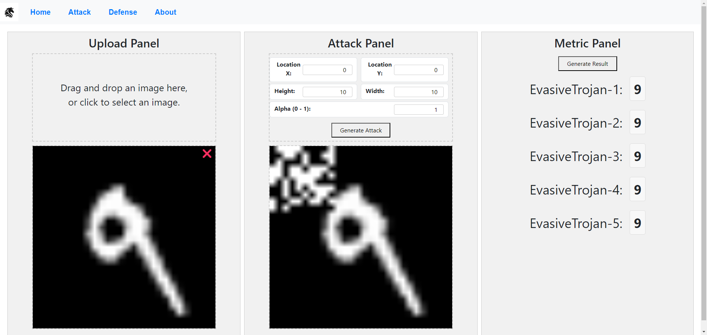

# Customized-Trojan-Attacks-and-Detection
## A Full Stack Web Application, using Spring Boot as backend and React as frontend, in order to offer a customized trojan attack and detection interface for users.


I design a Interactive Attack Generator Interface in order to better compare the performance of our Strength-enhanced Backdoor Attack and nowadays methods. We utilized Spring-Boot as our back-end server and React as front-end, server will run PyTorch scripts in order to transform the image to tensor, generate the Strength-enhanced Backdoor Attack and use them in our model.

Compared to current methods, our methods are more sensitive to size, location and specific parameters. As shown in the figure below: 
The attack is easy to be found in current methods, however our models will reject it using Strength-enhanced Backdoor Attack method.

## How to run the code
### Run React App
```
cd frontend
npm start
```

You can now view frontend in the browser.

- Local:            http://localhost:3000
- On Your Network:  http://yourlocalhost:3000

### Run Spring Boot Server
Maven is required to run the server. 
Find `backend/server/src/main/java/trojanand/server/ServerApplication.java` and run it using IDE.
If you prefer to run it using command line, run the following command in `backend/server` directory.
```
mvn spring-boot:run
```

# Todo List
- [x] Upload Panel
  - [x] Upload Button
  - [x] Api to Server
  - [x] Show the uploaded file
- [x] Attack Panel
  - [x] Config Form
  - [x] Add Trojan Button
  - [x] Show the added trojan file
- [x] Detection Panel
  - [x] Run Detection Button
  - [x] Show the detection result